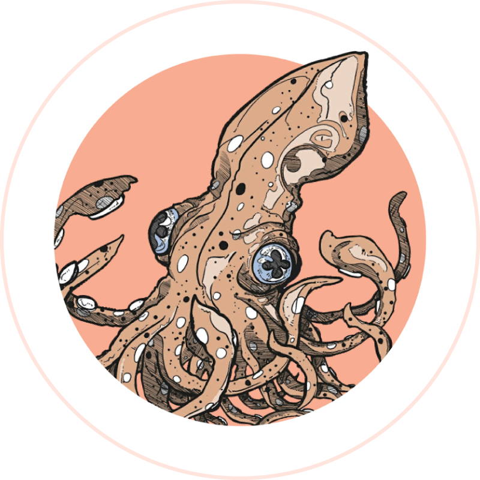

<p align="center">
  
</p>

<h1 align="center">untaughrod.com</h1>

<p align="center">
  Portfolio of <strong>Thales Medeiros</strong> — product design, illustration,
  3D, and the software that came after.
</p>

<p align="center">
  <a href="https://untaughrod.github.io"><strong>View the site →</strong></a>
</p>

---

A decade of design work — illustration, 3D modelling, product design — and then
the engineering to build the thing myself. This site is the portfolio and the
proof at the same time: every pixel and every line of it is mine.

> Designed and built end to end. No template, no page builder, no drag-and-drop.

## Screenshots

<!--
  Add screenshots here. Drop images into docs/screenshots/ and reference them:
    
    
  A wide shot of the hero works well first, then the work carousel and the
  two themes side by side.
-->

_Screenshots coming soon._

## Highlights

- **A hero modelled in code, not downloaded.** The retro handheld in the header
  is built from primitives in three.js — rounded extrusions, a canvas-textured
  LCD, a peach rim light. There is no `.glb` to fetch, and it recolours straight
  from the site's design tokens.
- **Nothing loads that isn't needed.** three.js is 540 KB, so it is dynamically
  imported and only fetched once the canvas nears the viewport — never on a
  browser without WebGL2, and never for a visitor who prefers reduced motion.
- **Project cards with no runtime API call.** The GitHub API is read at *build*
  time and the site rebuilds nightly, so visitors get no spinner, no rate limit,
  and no third-party request.
- **Two themes, measured rather than eyeballed.** Every text-and-surface pair in
  both light and dark was contrast-tested; all clear WCAG AA and most clear AAA.
- **A work strip that runs itself.** An infinite carousel, duplicated at runtime
  to whatever the viewport needs, that pauses on hover, on focus, and on demand
  — and stops entirely for anyone who prefers reduced motion.
- **One drawing becomes every asset.** A single logo file derives the favicons,
  the Apple touch icon, the maskable Android icons, a hand-assembled `.ico`, and
  the 1200×630 social card.

## Tech stack

Astro 7 · TypeScript · three.js · GSAP ScrollTrigger · Lenis · sharp ·
GitHub Actions → GitHub Pages

## How it's built

- **Static, with islands.** Astro ships zero JavaScript by default; interactivity
  is opted into per component, which is why a WebGL hero doesn't slow down the
  rest of the page.
- **The accent had to split in two.** The brand peach `#f8ac92` is sampled from
  the logo, but it is a *light* colour — against a light background it measures
  **1.66:1**, failing WCAG by roughly 2.7×. So the accent became two roles: the
  peach stays as a block fill, and a hue-locked deep terracotta carries text and
  borders in light mode. 6.09:1 light, 10.77:1 dark.
- **Themes via `light-dark()`.** Each token holds both values on one line, driven
  by `color-scheme` on the root — so the palette can't drift out of sync, and
  scrollbars and form controls theme themselves for free.
- **WebGL listens for the theme.** Shaders can't read CSS custom properties, so
  the scene subscribes to a `themechange` event and retunes its lighting: a rig
  lit for near-black turns the model into a silhouette against off-white.
- **Assets are derived, not hand-exported.** `npm run assets` finds the logo's
  disc by marching in from each edge until the flat white background ends, then
  generates every icon size from it.

## Performance

Measured on the production build:

| | |
| --- | --- |
| Total site | **2.6 MB**, including 16 pieces of artwork |
| CSS | **31 KB** |
| Nav logo | **545 KB** source → **2.8 KB** shipped (WebP) |
| Artwork | **20 MB** of sources → **1.3 MB** of WebP served |
| three.js | **540 KB**, lazily imported — not in the initial load |

## Accessibility

- `prefers-reduced-motion` is honoured everywhere: the WebGL scene is never
  downloaded, smooth scrolling is skipped, and scroll reveals resolve instantly.
- Content is fully readable if JavaScript never loads — reveals are CSS
  transitions, not JS-injected styles.
- Colour pairs are verified against WCAG rather than assumed.
- The render loop pauses when the hero leaves the viewport or the tab is
  backgrounded.

## Local development

```bash
npm install
npm run dev
```

Then open <http://localhost:4321>.

```bash
npm run build
```

## Documentation

[**docs/MAINTAINING.md**](docs/MAINTAINING.md) — where things live, the theme
token architecture, the brand asset pipeline, and the custom-domain migration.

## License

Source code is [MIT](LICENSE).

**The artwork is not.** The squid logo, illustrations, and portfolio images in
`src/assets/` are © Thales Medeiros, all rights reserved — see
[`src/assets/NOTICE.md`](src/assets/NOTICE.md). Reuse the code freely; please
don't reuse the drawings.

---

<p align="center">
  Made by <a href="https://github.com/untaughrod">untaughrod</a> ·
  <a href="https://untaughrod.github.io">untaughrod.com</a>
</p>
